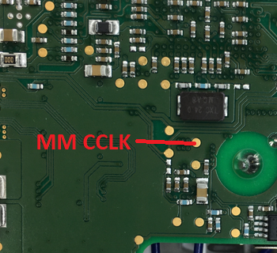

# Rooting the Bosch SmartHome Controller I

During the Christmas break of 2019 I had a lot of time and I decided to have a look at the Bosch SmartHome Controller (version 1) from a hardware security perspective. I bought one from the local [hardware store](https://www.obi.de/hausfunksteuerung/bosch-controller-smart-home-weiss/p/1229350) and began to disassemble it thanks to [iFixit](https://www.ifixit.com). Here's a picture:


At the center of the device there is a TI processor with a TI logo and the marking `SNI5065260BZCZ`, a DDR3 SDRAM and an eMMC Flash IC. The first challenge was to find out which processor it was -- a marking search on the TI website was not very successful:


Because of...

* The package (15 * 15 mm, 18 * 18 balls with 0.8 mm pitch) and
* the peripherals (DDR3, ...) and
* the area of use (IoT)

... the best suitable candidate was the TI Sitara AM335x processor in "High Security" (HS) mode. The confirmation came from the pin assignment.
Interestingly, I found a [related work with the same IC](https://www.usenix.org/system/files/woot19-paper_ullrich.pdf) in which the researchers performed a cold boot attack against the same system exploiting a vulnerability in the QNX bootloader. This was not possible in my case.

## Finding UART

The next step was to "sniff" the primary UART communication `UART0` which normally gives information about the boot process and the firmware. Finding the UART TX test point was not difficult as seen in the picture below:


And this is what came out:

```
U-Boot SPL 
SHC
MPU reference clock runs at 6 MHz
Setting MPU clock to 594 MHz
Enabling Spread Spectrum of 18 permille for MPU
OMAP SD/MMC: 0 @ 26 MHz, OMAP SD/MMC: 1 @ 26 MHz
Booting from eMMC!
reading u-boot.img
reading u-boot.img
## Verifying secure image at 807fffc0 ... OK


U-Boot 

I2C:   ready
DRAM:  512 MiB
Enabling the D-Cache
MMC:   OMAP SD/MMC: 0 @ 26 MHz, OMAP SD/MMC: 1 @ 26 MHz
Net:   cpsw
mmc1(part 0) is current device
eMMC detected on device 1
## Error: "emmc_erase" not defined
Active root is partition 5 (root1)
7338536 bytes read in 510 ms (13.7 MiB/s)
Booting Linux from eMMC ...
32204 bytes read in 27 ms (1.1 MiB/s)
device tree detected
## Verifying secure image at 84000000 ... OK
## Booting kernel from Legacy Image at 84000000 ...
   Image Name:   Linux-4.4.258-shc
   Image Type:   ARM Linux Kernel Image (uncompressed)
   Data Size:    7338192 Bytes = 7 MiB
   Load Address: 80008000
   Entry Point:  80008000
## Verifying secure FDT image at 85000000 ... OK
## Flattened Device Tree blob at 85000000
   Booting using the fdt blob at 0x85000000
   Loading Kernel Image ... OK
OK
   Using Device Tree in place at 85000000, end 8500acb3

Starting kernel ...
```

At the boot screen we see that Linux is implemented with uBoot SPL and uBoot as bootloaders. We also see that Secure Boot is in place which is shown by the message `Verifying secure image`, so that only signed firmware is allowed to run. At first, I did not found the UART `RX` interface which is needed to transfer data from the PC to the device. In fact, after desoldering the processor I found out that it was not connected / wired at all! Here is the location of the RX pin:


The UART RX ball is located in the middle of the device (see red dot in the picture), not easily accessible from the outside. With professional BGA reworking tools, it is possible to 1) desolder the BGA, 2) solder a wire to this ball and 3) to resolder the BGA. But I do not have that kind of equipment and therefore I wanted to do something simpler: putting a 0.15 mm enameled copper wire (in German `Kupferlackdraht`, one of the most important hacker tools) under the BGA, stripping the insulating layer only for a few tenths of millimeters and trying to contact the particular ball. This happened to work well (and it still works):


*Now we come to the point where one device will get hurt (sensitive minds please skip this section).* 😅

## Dumping the Firmware

Obviously, the next step was to dump the flash content. An eMMC flash can be read out with a standard SD card reader, so that soldering a card reader to the eMMC has been done. I decided to desolder the processor and then solder the wires involved to the eMMC interface (6 wires). On the picture below you can also see the SD card adapter which has been connected to a PC. Desoldering the processor has been done with an hot air gun from the hardware store.


Everything went well and the firmware was not encrypted. There were 6 partitions, the first partition contained the bootloader files `MLO` and `u-boot.img`. **MLO** was the primary bootloader. From the [TI user manual](https://www.ti.com/lit/ug/spruh73q/spruh73q.pdf):

> MMC/SD Cards or eMMC/ eSD devices may hold a FAT file system which ROM Code is able to read and process. The image used by the booting procedure is taken from a specific booting file named "MLO". This file has to be located in the root directory on an active primary partition of type FAT12/16 or FAT32.

Details about the MLO bootloader files were not publicly available 😢 but let's see what we can discover. Having a look at the binary with [HxD Hex Editor](https://mh-nexus.de/de/hxd/), I could see a number of readable strings. I assumed that the first four bytes may be a length field which is used by the ROM code to load this amount of data (see the red underlined value of `0x1400` in the picture below). The second 32-bit word seemed to correspond to the length of the Initial Software (ISW); see yellow underlined value.


Here is a dump of the ISW, beginning with a RSA2048 signature (256 random-like bytes) followed by the main excutable code itself which starts with an interrupt vector table:


As we all know, manipulating length fields is one of the most important hacker skills 😉 It became evident that the length field of the Initial Software was not checked and that we could crash the device by changing this value. To investigate further, I first connected an oscilloscope to the interface between eMMC and AM335x to see how many data packets are transferred. Next, I measured the current flowing in the AM335x power supply to identify the current state of the controller. This way I could distinguish between lockdown and crash states as the controller consumed a different amount of power in each of them.

## Overflowing the internal On Chip RAM (OCRAM)

Here is a very simplified description of the first boot steps:
1. ROM Bootloader starts, it uses the internal On-Chip RAM (OCRAM). SDRAM is not initialized.
2. At some point, ROM Bootloader loads the user bootloader (MLO) from eMMC in internal OCRAM
3. ROM Bootloader transfers control to the user bootloader code

The [user manual](https://www.ti.com/lit/ug/spruh73q/spruh73q.pdf) gives us some information about the memory layout of the OCRAM during the boot process:


The BootROM requires a stack in the OCRAM located at the address `0x4030B800`. At the same time the image is loaded into OCRAM at address `0x403000000`. So, by changing the length field of the Initial Software (ISW) in the MLO bootloader we can overwrite parts of the OCRAM public stack (see red underlined value in the image above).

Now we can place a valid return address at a specific place of our modified ISW image and the program pointer will then load this address at the next function call return (i.e., something like `pop pc`). As a result, we can place our own code at some place in the ISW image, adding the magic return address and our code will get executed **BEFORE** the RSA signature is verified! This means that Secure Boot is most probably broken 🚀

## Bypassing Secure Boot

This was my initial assumption on how we could possibly bypass Secure Boot on the Bosch SmartHome Controller I:

1. BootROM starts and loads some initial code and parameters from eMMC in internal On Chip RAM (OCRAM). ROM code is immutable.
2. BootROM checks signatures of the initial code and parameters. The Root Public Key is most probably located into Fuses in the device (there is no internal flash).
3. BootROM loads the manipulated, too big Initial Software ISW in OCRAM, stack is corrupted.
4. Normally, at this point the BootROM checks signature of ISW and runs ISW if the signature is valid - otherwise going in a secure lockdown state. In our case the PC is updated with an address pointing to our SW.
5. Code execution 🥳

This said, we need a bootloader binary to load and run u-boot. The simplest way to get one is to patch the original one i.e. find the secure boot branch and patch it. I tried to patch the bootloader with Ghidra and run it but nothing happened. In fact, the eMMC interface is somehow broken after corrupting the normal program sequence, so that loading u-boot does not work. That's why I wrote my own bootloader with [TI Code Composer Studio](https://www.ti.com/tool/CCSTUDIO) to re-initialize everything correctly.

In order to run my new bootloader easily without desoldering and resoldering the eMMC Flash, I just changed the boot sequence of the Bosch SmartHome Controller. This is the device's boot order:

1. MMC1 interface
2. MMC0 interface
3. UART0 interface
4. USB0 interface

MMC1 is the on-PCB internal eMMC flash, whereas the MMC0 interface is connected to test points (see wiring setup in the image below). We can solder an SD card (via adapter) to these test points to let the controller boot from it. The SD card contains our MLO bootloader with the manipulated ISW length field as well as our malicious ISW image.


At boot time, we can skip the MMC1 interface by grounding the clock so that the device boots from the MMC0 interface (our SD card). As you can see in the picture below this worked as expected:


As you can see in the picture above, we were able to run our first small application **without having a valid RSA signature**. 

## Getting a U-Boot shell

Usually, at this stage, U-Boot is loaded next into SDRAM and runs. Our goal was now to get a U-Boot console. If not hardened, U-Boot can be easily interrupted (see for example the work of [Colin O'Flynn on the Philips Hue device](https://colinoflynn.com/2016/07/getting-root-on-philips-hue-bridge-2-0/)). Unfortunately, interrupting the flash loading process did not work on the Bosch SmartHome Controller I. However, if we have a look at the U-Boot `u-boot.img` binary, we see its environmental variables (see image below). The integrity of these variables is checked by Secure Boot -- which we broke already. 


Finally, we can change the variable `bootdelay` from `0` (no delay) to `9` (9 seconds delay) so that U-Boot can be interrupted by pressing any key during boot to get a console 🥳


## Getting a Linux root shell

Having a U-Boot shell, our next goal was to change the Linux root password without manipulating the hardware. For this, we searched the dumped flash contents for the typical password hash pattern of the `shadow` file (see picture below).


From the U-Boot console we could then easily replace the root password hash with the `mmc write` command (see image below).


And that's it. We got a root shell:


## Conclusion

In this post, I described how to root the Bosch SmartHome Controller I by exploiting a simple bug in the Secure Boot implementation. Besides some creativity, only a soldering iron and a SD card were needed to exploit this vulnerability :-)

## Responsible Disclosure

I disclosed this vulnerability to TI PSIRT and Bosch PSIRT in February 2020. In Mai 2021 I got a clearance to publish.

## Acknowledgements

Many thanks to Bosch Smart Home and Bosch PSIRT for their support, cooperation and feedback.
Note that I did not get any bug bounty.

Excellent review done by [stulle123](https://github.com/stulle123), thank you!

## Appendix

This is what you can do to boot the Bosch Smarthome Controller 1 with your own bootloader from a SD Card:

* Solder a [micro-SD Card adapter](https://www.amazon.de/SanDisk-microSD-Memory-Adapter-MICROSD-Adapter/dp/B0047WZOOO/) to the following test points on backside of the board:


* In the [boot](./boot/) directory of this repository you will find the modified MLO bootloader and U-Boot binaries I used to achieve code execution. Copy these files (without renaming them) into the root directory of a micro-SD card formatted with FAT32 or FAT16.

* To force the microprocessor to boot from the SD card, we need to skip the first boot option (MMC1 interface). For that we can for example ground the clock line. Use the following test point on the backside:



* Next, ground the clock, put the micro-SD card into the adapter connected to the test points and power on the device. First, the LEDs will blink crazily, just wait until U-Boot starts and you will see the message `Enter 'noautoboot' to enter prompt without timeout`. You have five seconds to type `noautoboot` and then you have a U-Boot shell.

**Note:** use short cables everywhere 


