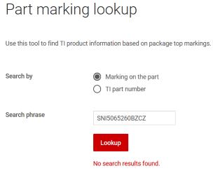

# Rooting the Bosch SmartHome Controller

During Christmas holidays 2019 I had a lot of time and I decided to have a look at the Bosch SmartHome Controller (version 1) from a hardware security perspective. I bought one from the local Obi [hardware store](https://www.obi.de/hausfunksteuerung/bosch-controller-smart-home-weiss/p/1229350) and began to disassemble it thanks [iFixit](https://www.ifixit.com), here is a picture:

At the heart of the device there is a TI processor with TI logo and the marking "SNI5065260BZCZ", a DDR3 SDRAM and an eMMC Flash IC. The first challenge was to find out which processor it is -research about the marking was not very successful:

Due to:
* The package (15 * 15 mm, 18 * 18 balls with 0,8 mm pitch)
* The peripherals (DDR3,…)
* The application (IoT)

… the best candidate was the TI Sitara AM335x processor in "High Security" (HS)variant. Confirmation came from the pin assignment. Interestingly, I found a [related work with the same IC](https://www.usenix.org/system/files/woot19-paper_ullrich.pdf). In this work they did a cold boot attack on the system exploiting a vulnerability in the QNX bootloader. This was not possible here.

The next step was to "sniff" the primary UART communication(UART0) which normally gives information about the boot process and the firmware. Finding the UART TX test point was not difficult but time intensive (connect [oscilloscope](https://www.picotech.com/oscilloscope/) to a new test point, reset, wait and see - goto begin):

And this is what came out:

TBD: pic

We see that Linux is implemented with uBoot SPL and uBoot as bootloaders. We also see that secure boot is in place ("Verifying secure image"), so that only signed firmware can (shall) be executed. I did not found the UART *RX* Interface at first, needed to transfer data from the PC to the device (ok, one could have redirected the UART standard communication to UART1 or 2 but we want to do HW). In fact, after desoldering the processor I found out that it was not connected / wired at all!
Here is the location of the RX pin:

The UART RX ball is located in the middle of the device (red dot), not easily available from outside. With professional BGA reworking tools, it is possible to 1) desolder the BGA 2) solder a wire to this ball 3) resolder the BGA. But I do not have that kind of equipment and therefore I wanted to do something simpler: threading an 0.15 mm enameled copper wire (in German Kupferlackdraht, one of the most important hacker tools) under the BGA, stripping the insulating layer only for a few tenths of millimeters and trying to contact the particular ball. This happened to work well (after some trials and it still works):

Now we come to the point where one device will get hurt (sensitive minds please skip this section).

Obviously, next step is to dump the flash content. An eMMC flash can be read out with a standard SD card reader, so that soldering a card reader to the eMMC has been done. I decided to desolder the processor and then solder the wires involved to the eMMC interface (6 wires):

