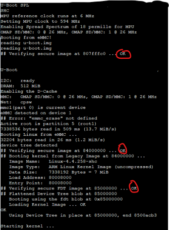
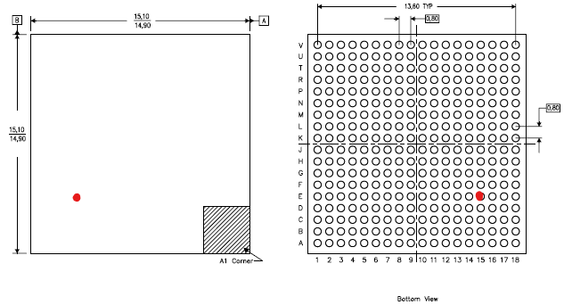

# Rooting the Bosch SmartHome Controller I

During Christmas holidays 2019 I had a lot of time and I decided to have a look at the Bosch SmartHome Controller (version 1) from a hardware security perspective. I bought one from the local Obi [hardware store](https://www.obi.de/hausfunksteuerung/bosch-controller-smart-home-weiss/p/1229350) and began to disassemble it thanks [iFixit](https://www.ifixit.com), here is a picture:

At the heart of the device there is a TI processor with TI logo and the marking "SNI5065260BZCZ", a DDR3 SDRAM and an eMMC Flash IC. The first challenge was to find out which processor it is -research about the marking was not very successful:

Due to:
* The package (15 * 15 mm, 18 * 18 balls with 0,8 mm pitch)
* The peripherals (DDR3,…)
* The application (IoT)

… the best candidate was the TI Sitara AM335x processor in "High Security" (HS) variant. Confirmation came from the pin assignment. Interestingly, I found a [related work with the same IC](https://www.usenix.org/system/files/woot19-paper_ullrich.pdf). In this work they did a cold boot attack on the system exploiting a vulnerability in the QNX bootloader. This was not possible here.

The next step was to "sniff" the primary UART communication (UART0) which normally gives information about the boot process and the firmware. Finding the UART TX test point was not difficult:

And this is what came out:

We see that Linux is implemented with uBoot SPL and uBoot as bootloaders. We also see that secure boot is in place ("Verifying secure image"), so that only signed firmware can (shall) be executed. I did not found the UART *RX* Interface at first, needed to transfer data from the PC to the device. In fact, after desoldering the processor I found out that it was not connected / wired at all!
Here is the location of the RX pin:

The UART RX ball is located in the middle of the device (red dot), not easily available from outside. With professional BGA reworking tools, it is possible to 1) desolder the BGA 2) solder a wire to this ball 3) resolder the BGA. But I do not have that kind of equipment and therefore I wanted to do something simpler: threading an 0.15 mm enameled copper wire (in German Kupferlackdraht, one of the most important hacker tools) under the BGA, stripping the insulating layer only for a few tenths of millimeters and trying to contact the particular ball. This happened to work well (it still works):

*Now we come to the point where one device will get hurt (sensitive minds please skip this section).*

Obviously, next step is to dump the flash content. An eMMC flash can be read out with a standard SD card reader, so that soldering a card reader to the eMMC has been done. I decided to desolder the processor and then solder the wires involved to the eMMC interface (6 wires):

On the picture you also see the SD card adapter which has been connected to a PC. Desoldering the processor has been done with an hot air gun from the hardware store.
Everything went well and the firmware is not encrypted. There are 6 partitions, the first partition contains the bootloader files "MLO" and "u-boot.img". **MLO** is the primary bootloader. From the user manual:

> MMC/SD Cards or eMMC/ eSD devices may hold a FAT file system which ROM Code is able to read and process. The image used by the booting procedure is taken from a specific booting file named “MLO”. This file has to be located in the root directory on an active primary partition of type FAT12/16 or FAT32.

Details about the MLO files are not publicly available :-( but let's see what we can learn about it. Having a look at the file with [HxD Hex Editor](https://mh-nexus.de/de/hxd/), we find different parts beginning with readable strings. The first part has the length 0x1400, which corresponds to the first 32 bit words (underlined red, note the endianness), this may be a length field used by the ROM code to load this amount of data. The second word (underlined yellow) corresponds to the length of the Initial Software (0x9810):

Here is a dump of the ISW, beginning with a RSA2048 signature (256 random-like bytes) followed by the code itself (starting with an interrupt vector table):

Manipulating length fields is one of the most important hacker tools. It came out that the length field of the Initial Software is not checked and we can put any value there, crashing the device. To find that out, I 1) connected an oscilloscope to the interface between eMMC and AM335x to see how many data packets are transferred and 2) measured the current flowing in the AM335x power supply to differentiate between states (lockdown and crash states have different power consumptions).

**What happens if too many data are loaded in the OCRAM?**

The [user manual](https://www.ti.com/lit/ug/spruh73q/spruh73q.pdf) gives us some information about the memory layout of the OCRAM during the boot process:

The BootROM needs a stack in OCRAM located at 0x4030B800 and in the same time the image is loaded in OCRAM at address 0x403000000. *It will be apparent to those skills in the art* that a stack corruption can happen if too many data are loaded. And this is exactly what happens when we increase the size of the ISW part to an "illegal" value. 

We can place a valid return address at a specific place of the increased ISW and the program pointer is then loaded with this address at the next function call return (something like "pop pc"). So we can place our own code at some place in the ISW part, putting the magic address and our code is executed… BEFOREthe signature is checked! This means: secure boot is probably broken.

**Summary: How does secure boot process is bypassed (guesses):**

1. BootROM starts and loads TOC from eMMC in internal On Chip RAM (OCRAM). ROM code is immutable.
2. BootROM checks signatures of TOC contents, including an application called PPA and runs it. PPA is part of the TOC. The Root Public Key is most probably located into Fuses in the device (there is no internal flash).
3. BootROM loads the manipulated, too big Initial Software ISW in OCRAM, stack is corrupted.
4. Normally, at this point the BootROM checks signature of ISW and runs ISW if the signature is valid -otherwise going in a secure lockdown state. In our case the PC is updated with an address pointing to our SW.
5. Our code runs without check

Normally, the next step would be to reverse engineer the MLO/SPL binary, find the secure boot branch and patch it. I tried to patch the bootloader with Ghidra but nothing happened. In fact, the eMMC interface is somehow broken after corrupting the normal program sequence, so that loading u-boot does not work. That's why I wrote my own bootloader with [TI Code Composer Studio](https://www.ti.com/tool/CCSTUDIO), re-initializing everything correctly.
In order to run this bootloader easily without desoldering and resoldering the eMMC Flash, I used a feature of the boot process: at boot time, the processor looks for valid data in different devices in the so called boot sequence. This boot sequence can be customized with some pins, here is the boot sequence used in the Bosch SmartHome Controller:

1. MMC0 Interface (internal MMC device)
2. MMC1 Interface (connected to test points)
3. UART0 Interface
4. USB0 Interface

MMC1 (the first boot device) is the on-PCB eMMC flash, whereas the second device MMC0 is connected to test points. We can solder an SD card (via adapter) to these test points containing our modified MLO with the buffer overflow hack and a new application:

At boot time, the MMC1 interface must be made unavailable (grounding the clock worked for example) so that the device skips MMC1 and looks into MMC0, finding an MLO and running it:

Our first small application runs in the device **without signature**. Normally, at this stage, uBoot is loaded into SDRAM and runs. Our goal is now to get a uBoot console. If not secured, uBoot can be easily interrupted, see for example the work of [Colin O'Flynn on the Philips Hue device](https://colinoflynn.com/2016/07/getting-root-on-philips-hue-bridge-2-0/). This particular hack (disturbing the flash loading process) did not work in the Bosch SmartHome Controller I. If we have a look at the uBoot binary, we see that the environmental variables are embedded in the binary (found in the u-boot.img file). Integrity of these variables is checked by secure boot - broken now. We can manipulate one specific variable "bootdelay" from 0 (no delay) to 9 (9 seconds delay) so that uBoot can be interrupted and a console is available:

We have a console:

Having done that, our next goal is to change the Linux root password in the device in order to "be root" without manipulating the hardware. First we search the dumped flash content for the typical root password hash format. Replacing it on place with an own root password hash (generated with openssl passwd) was possible with the uBoot console using the mmc commands *mmc write*.

And that's it.

**Conclusion**

In this post, I described how to root the Bosch SmartHome Controller I, exploiting a secure boot bug (buffer overflow / stack corruption) and some other interesting hardware security aspects. To exploit this vulnerability, only a soldering iron and a SD card are needed - besides the required adversarial thinking.

**Disclosure**

I disclosed this vulnerability to TI PSIRT and Bosch PSIRT in February 2020.
