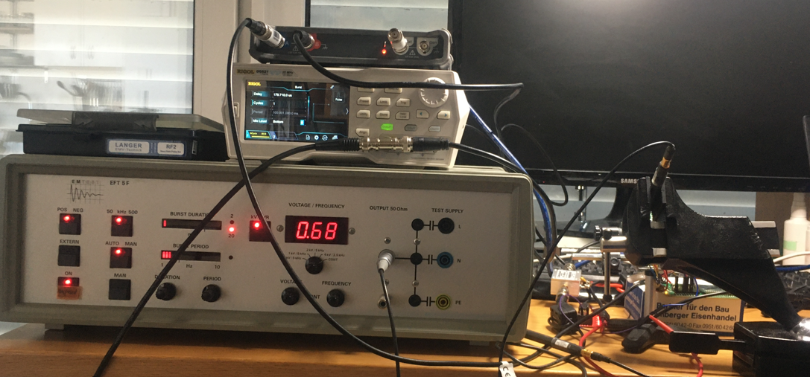

# Extracting the Firmware of a Smart Home Device with Electromagnetic Fault Injection (EM-FI)

In this post, we will perform an Electromagnetic Fault Injection (EM-FI) attack against an EFM32 microcontroller found in a Bosch Smart Home device to re-open its debugging interface and extract the firmware. Put on your tinfoilhat and enjoy! 🤓

Please note that the vulnerability described here has already been [disclosed by "LimitedResults"](https://limitedresults.com/2021/06/enter-the-efm32-gecko/) in 2021.

## Discovering Debug Access on the Bosch Smart Home Device

After opening the Bosch Smart Home device (the `Rolladensteuerung I` in German), we find two PCBs with the following components:

We will focus on the main microcontroller, the EFM32 from Silicon Labs (codename `Gecko`):

Regarding debugging interface protection the [user manual](https://www.silabs.com/documents/public/reference-manuals/EFM32G-RM.pdf) of the EFM32 says:

A debug lock feature is implemented through flash lock bits. Unlocking the device is always possible -- but there's a cost: flash and SRAM contens are erased before the device is unlocked (not good if you want to extract the firmware 😉).

Now, let's connect a debugger to the EFM32G210F128. I'm using the EFM32 Gecko Starter Kit from Silicon Labs with an integrated Segger debugger which is connected to the target via the Serial Wire Debug (SWD) interface. The SWD interface is connected to test points on the board (see image below):

This is what happens when we connect to the debugging interface:

As you can see in the image above the device is locked and there's no way to extract the firmware for now. However, by reviewing related work I discovered that "LimitedResults" [managed to re-open the debug interface with Electromagnetic Fault Injection](https://limitedresults.com/2021/06/enter-the-efm32-gecko/). 

## Performing EM-FI against the EFM32

With the Electromagnetic Fault Injection technique, an attacker induces faults into an Integrated Circuit by generating a local transient magnetic field close to it. This magnetic field couples into some current loops or bond wires which causes the device to fault (e.g., bit flips). We are interested in faults which switch our device into an insecure state. 

In complex Integrated Circuits, inducing such a fault is like finding a needle in the haystack. This is due to the large parameter space: timing, positioning of the probe, pulse parameters (amplitude, polarity), phase of the moon, etc. In the following sections we describe how to find these parameters to induce faults as precisely as possible.

### Generating a Magnetic Field

To produce a strong, local and fast-changing magnetic field, we need a pulse generator with a high voltage (up to a few `kV`) and a magnetic field source. As described in their [blog post](https://limitedresults.com/2021/06/enter-the-efm32-gecko/), "LimitedResults" built a custom EM-FI pulse generator and probe. I'm a bit lazy and I wanted a fast result without building everything from scratch.

In fact, we can take the same equipment used in the field of Electromagnetic Compatibility (EMC) and modify it for our purposes. An `Electrical Fast Transient` (EFT) pulse generator connected to a magnetic field source from [Langer EMV](https://www.langer-emv.de/en/index) is very suitable for our use case. I was lucky enough to find a second-hand Langer BS 06DB-s pulse generator as these devices are usually quite expensive.

However, there is still a problem: the EFT devices cannot be triggered from an external signal (in some cases they can but with a very high jitter). For EM-FI we need an external trigger with low-jitter in order to reproduce the fault timing. By opening the [Langer BS 06DB-s](https://www.langer-emv.de/en/product/accessory-eft-burst-generators-iec-61000-4-4/15/h5-ic-set-eft-burst-magnetic-field-source/1283/bs-06du-s-eft-burst-magnetic-field-source/1279) pulse generator (⚠️⚠️⚠️ warning: high voltage ⚠️⚠️⚠️) we can bypass the internal logic and connect an external signal directly to the internal high-voltage switch control input (see image below):

We now have a pulse generator and a magnetic field source but we still need some kind of programmable delay line. The EM-FI sequence begins with an event (e.g., a Reset pulse) followed by a delay (low jitter) and then the pulse itself. The delay shall be programmable to automate and repeat the sequence. For this, I used a [Rigol Signal Generator](https://www.rigol.eu/products/waveform-generators/dg800.html) with an external trigger input that can be controlled remotely.

The full setup is depicted in the figure below:

Next, we have to find the probe position. In order to automate this step, I wrote a couple of small scripts to control the target and signal generator (see [code](./code/) folder) -- my excellent software skills are still sufficient for that 😜 --. The programmed signal generator will then, after the programmed delay, trigger the pulse generator to create the electromagnetic field.

### Inducing the Fault

Finding the right timing when to induce a fault can be very tricky. In my case the following approach worked out just fine: during the boot process, the EFM32 will read out the flash lock bits and depending on the state of these bits lock the debug interface or not. With a simple side-channel analysis, we may be able to find out the timing *where* this happens by measuring the power consumption of the device in both cases (unlock and lock). We can measure the dynamic power consumption very precisely by putting a magnetic field probe near a decoupling capacitor (see figure below).

You scan see the different measurements in the screenshot below: the power trace depicted in green for `unlock` and the red colored trace for `lock`. We can easily identify the power consumption differences by having a close look at the trace. The time between those differences and the reset signal (trigger for the measurement) gives us the delay.

However, there's a caveat here: the device boots with an internal RC oscillator whose frequency is quite temperature dependent. Therefore, we will have to proceed for our delay search a bit.

Finding the correct position and pulse amplitude was done in a brute force attempt. There is only one "side channel" indication: if the device resets itself, then the amplitude of the pulse may be too high. Normally, interesting faults appear at the boundary between "nothing happens" and "reset". In the end I found the correct position to induce a fault successfully (as shown in the image below).

### Enabling Debug Access

And finally we have an open debugging interface! Note that the EM-FI does not change the flash content but only some internal CMOS register values, so this state is not permanent. Let's connect to the debugging interface without doing a reset 😉 and voilà:

With [Segger J-Flash](https://www.segger.com/products/debug-probes/j-link/tools/j-flash/about-j-flash/) we can extract the whole flash content:

As a last step, we can re-enable the debug interface permanently by changing the debug lock bits and re-program the device.

After the next reset, the debug interface is still available and the device works normally. We can connect a debugger and in parallel analyze the extracted firmware with a disassembler / decompiler tool -- but that's another story...
