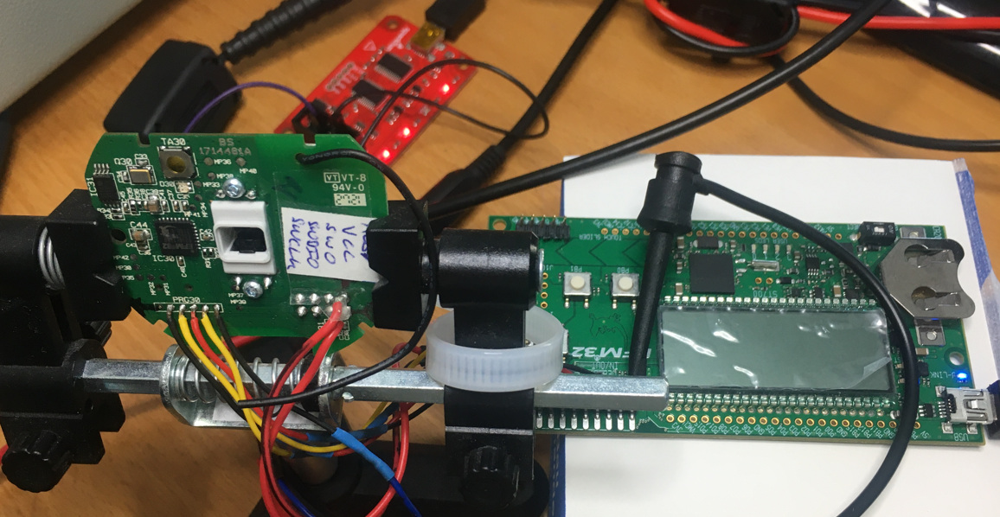
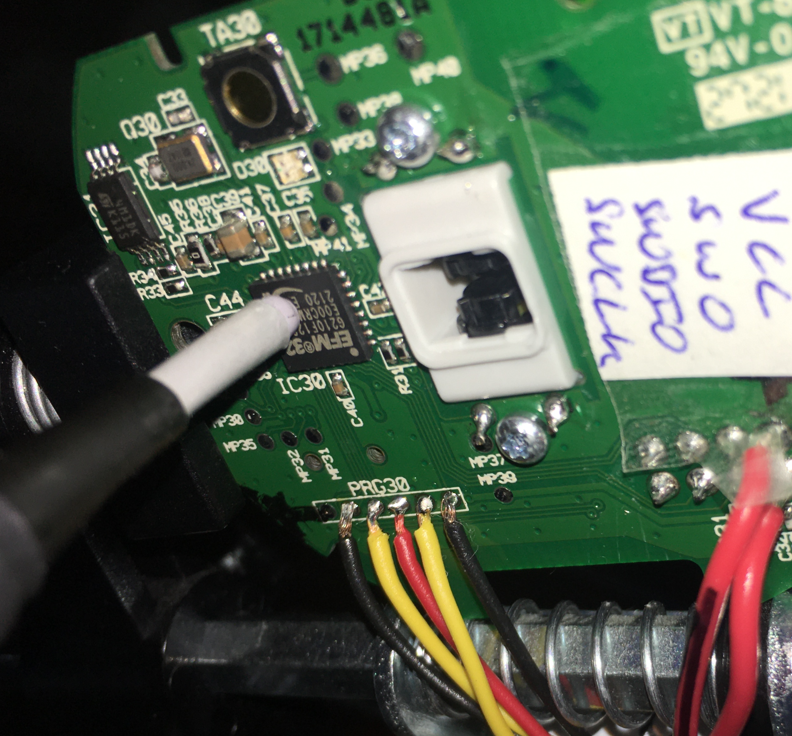

# Extracting the firmware of a Smart Home device with electromagnetic fault injection

In this post, we will perform an Electromagnetic Fault Injection (EM-FI) on a microcontroller found in a Bosch Smart Home device in order to re-open its debugger interface and extract the firmware. Put on your tinfoilhat and enjoy!

Note that the vulnerability described here has already been [disclosed 2021 by "limited results"](https://limitedresults.com/2021/06/enter-the-efm32-gecko/) and an advisory has been published.

After opening a Bosch Smart Home device (the ["Rolladensteuerung I"), we find two PCBs with following components:

We will focus on the main microcontroller, the EFM32 from Silicon Labs (the "Gecko"):

Regarding debugger interface protection, the user manual of the EFM32 says:

A debug lock feature is implemented through flash lock bits. Unlocking the device is always possible - but there is a cost: flash and SRAM are erased before the device is unlocked (not good if you want to extract the firmware).

Let's connect a debugger to the EFM32G210F128. I'm using an eval board from Silicon Labs with integrated Segger debugger (EFM32 Gecko Starter Kit) connected to the target via the Serial Wire Debug Interface SWD. The SWD interface is contacted to test points on the board (Fluke helps):

This is what happens when connecting the target:

Device is locked, no way to extract the firmware at the moment. However, by scanning the related works to this device I found that [someone has managed to re-open the debug interface with electromagnetic fault injection](https://limitedresults.com/2021/06/enter-the-efm32-gecko/). 

**We will now reproduce this EM-FI.**

With the electromagnetic fault injection technique, an attacker induces faults inside an integrated circuits by producing a local transient magnetic field near it. This magnetic field couples into some current loops inside the device (or device bond wires) and produces logical/digital faults. We are interested in faults which put our device in an insecure state. In complex integrated circuits, inducing such a fault is like finding a needle in the haystack. The parameter space is quite large: timing, position of the probe, pulse parameters (amplitude, polarity), phase of the moon… In the following sections we will see how to induce faults precisely and find the correct parameters.

To produce a strong, local and fast-changing magnetic field near the device, we need a pulse generator with a quite high voltage (up to a few kV) and a magnetic field source. In the blog mentioned above, the colleague built his own EM-FI pulse generator and probe. I'm a little bit lazy and I wanted a fast result without building everything from scratch. We can take some equipment used in the field of Electromagnetic Compatibility (EMC) and modify it for our case. An "Electrical Fast Transient" (EFT) pulse generator connected to a magnetic field source from Langer EMVis a very good approach. I was lucky to find such an old, second hand pulse generator (these devices are normally quite expensive) and acquired a Langer BS 06DB-s probe too. However, there is still a problem: the EFT devices cannot be triggered from an external signal (or in some cases they can - but with a very high jitter). For EM-FI we need an external trigger with low-jitter in order to be able to reproduce the fault timing. After opening the pulse generator (warning: high voltage!!!) we can bypass the internal logic and connect an external signal directly to the internal high-voltage switch control input:

We now have a pulse generator, a magnetic field source but we still need a kind of programmable delay line: the EM-FI sequence begins with an event (e.g. a Reset pulse) followed by a delay (low jitter) and then the pulse itself. The delay shall be programmable to automatize and repeat the sequence. I have a Rigol Signal Generator with an external trigger input which can be remote controlled - that fits.

Here is the full setup:

We will have to find the probe position manually but a 3D printer may be used as a cheap automatic positioning system (future project). In order to automatize the whole setup, I wrote some small scripts to control the target (try to connect) and the signal generator (generating a reset and program the delay) - my software skills are sufficient for that. The programmed signal generator will then, after the programmed delay, trigger the pulse generator to create the electromagnetic field.

**How to begin the search and find the needle (i.e. the delay)?**

Following idea may help: during the boot process, the EFM32 will read out the flash lock bits and - depending on the state of these bits -lock the debug interface or not. With a simple side-channel analysis, we may be able to find out the timing where this happens by measuring the power consumption of the device in both cases (unlock and lock). We can measure the dynamical power consumption very precisely by putting a magnetic field probe near a decoupling capacitor like this:

That's the result measured with my picoscope (green [unlock] and purple [lock] traces stacked). By having a detailed look at this trace, we can search for the first differences (alignment has to be done manually) and note the delay between reset and these differences:

**Caveat** the device boots with an internal RC oscillator, which frequency is quite temperature dependent. We will have to extend our search a bit due to that.
Finding the position and pulse amplitude was more like brute force search. There is only one "side channel" indication: if the device resets itself, then the amplitude of the pulse may be too high. Normally, interesting faults appear at the boundary between "nothing happens" and "reset". At the end I found this position to be successful:

And we have an open debugger interface! Note that the EM-FI does not change the flash content but only some internal CMOS register values / states, so this state is not permanent. Let's connect the device with the debugger (without doing a reset please):

With Segger J-Flash we can extract the whole flash content:

As a last step, we can re-enable the debug interface permanently by changing the debug lock bits and re-program the device.

After the next reset, the debug interface is still there and the device works normally, so that we can connect a debugger and in parallel analyze the extracted firmware with a disassembler / decompiler tool - but that's another story…
