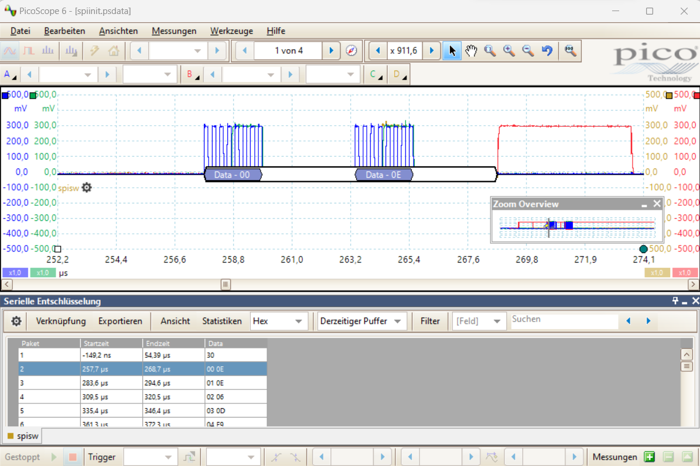

# The Universal Smart Home Ping of Death

In [part 2](./../P2/README.md) of this write-up we performed an Electromagnetic Fault Injection (EM-FI) attack against a Smart Home device to extract its firmware. This time we will reverse engineer parts of the proprietary radio-protocol, build a simple fuzzer and... Wait no spoilers please! ;-)

## The Target

The shutter control ("Rolladensteuerung" in German) is again our guest for today:


This nice device makes your shutters smart and is connected over a wireless interface to the Smart Home Controller. This time we will attack the wireless protocol which is definitely easier to do than [EM-FI](./../P2/README.md). To perform the analysis we need a tool to sniff the communication and generate arbitrary packets. The shutter control device works in the 868 MHz ISM band, that's what the technical specification says (in German):

> Funkfrequenz 868,3 MHz; 869,5 MHz

There are tons of different wireless protocols used in this band and it happens that Bosch is using a proprietary protocol for this device. As such, reverse engineering is needed here.

Let's open the device and look for the RF module:


On the image above we see the transceiver module connected to the black quarter-lamda wire antenna. Note, that I bypassed the `230 V` to `12 V` power supply for safety reasons and supplied the device with `12 V` directly. In order to reverse engineer the physical layer we need information about the transceiver module. The heart of this module is a Texas Instrument (TI) Integrated Circuit (IC), the CC1101. From the [specification](https://www.ti.com/lit/ds/symlink/cc1101.pdf):


Before usage, this IC needs to be configured with several radio and link parameters for each power-up as there's no persistent memory. It's connected to the EFM32 microcontroller via a SPI interface. The next step is to sniff the SPI interface and record the parameters. To do that I used my picoscope with the serial decoding feature (one channel `clk`, one channel `data` and one channel `chip select`):



In the picture we can see that the microcontroller is writing some data into the CC1101 at boot time: `0x0E` is written into register `0x00`, the value `0x0E` in register `0x01`, etc.

## The "Fuzzer"

To hunt for simple implementation bugs I built a simple fuzzer for the communication protocol (the code can be found [here](./code/)). Since we'll fuzz the protocol via SPI, we need to find a way to control the SPI interface of the transceiver module. For this I desoldered a transceiver module from a "window contact" ("Fensterkontakt" in German) device and connected it to a [BusPirate](http://dangerousprototypes.com/docs/Bus_Pirate) over SPI. The Bus Pirate itself is connected to a PC over USB. Here's the setup:


If you want to build it, this is the pinout of the RF module (top view). Connect the SPI signals (`CS`, `CLK`, `MOSI`, `MISO`) to the Bus Pirate SPI interface and VCC to `3,3 V`.


To access and configure the Bus Pirate in raw SPI mode (it's faster than normal mode), I wrote a [small old-school C program](./code/). It's also used to configure the CC1101 with the parameters extracted in the section above. I implemented simple state machines to receive or send arbitrary packets and perform manipulations. Here you can see some received packets sniffed from the SPI bus:


## Protocol Link Layer

The CC1101 does not only handle the physical layer but also parts of the link layer. This is the packet format:


In our case, the length field and CRC are used whereas the address field is not used. From a security point of view this is important: for example, the CC1101 automatically discards packets which are too long or which have a wrong CRC. Note, that the data packets are also scrambled before being sent (data scrampling is implemented on the EFM32 microcontroller).

The upper communication layers are handled by the EFM32G210F128 microcontroller from Silicon Labs. It's optimized for low power, has 128 kB flash memory and 16 kB SRAM, and uses execution-in-place (i.e., code can be executed from flash memory directly). The EFM32 also has an AES hardware accelerator (!) and a debugger protection which is [vulnerable to EM-FI](./../P2/README.md).

Here are some information about the upper communication layers I was able to find by playing with the device:

* Data scrambling is used (probably for better radio performance). It's implemented inside the EFM32 microcontroller. Packet scrambling and descrambling functionality is also implemented in my [fuzzer](./code/). Note, that reverse engineering the scrambling algorithm required on-chip debugging and firmware analysis in Ghidra.
* Most of the packets are protected against manipulation, eavesdropping and replay attacks. The device uses AES128-CCM as described in [RFC3610](https://www.rfc-editor.org/rfc/rfc3610) and an individual initial key.
* There are small unencrypted acknowledgment (ACK) packets (similar to ZigBee).

Now, back to the fuzzer. Just generating random packets won't work. A good starting point is to use already captured packets and manipulate to generate corner cases. Fuzzing is successful if we detect a malfunction or a crash of the device. Let's first record three different valid "sesame-open-the-shutters" commands from the Smart Home Controller (HEX values, CRC is omitted, packets are de-scrambled):

> *19* 10 00 8E   **4C 57 F4**   53 D4 01   **00 CF 67 74**   CE 9F BB 19   **54 75 85 10 48 DB C8 FD**

> *19* 10 00 8E   **4C 57 F4**   53 D4 01   **00 CF 67 77**   1D 9C 10 2B   **94 72 5C BD 87 BB 91 1A**

> *19* 10 00 8E   **4C 57 F4**   53 D4 01   **00 CF 67 7C**   F7 5C 0E 79   **03 E3 4B 64 32 AF 89 B9**

Here is a description of the different fields:

| Byte Nr     | Description |
| ----------- | ----------- |
| 0           | Length byte (excluding itself). In this example we have a `25+1` bytes packet.|
| 1..3        | Packet parameters (?)|
| 4..6        | Source address|
| 7..9        | Destination address|
| 10..13      | Replay counter|
| 14..17      | Encrypted MAC|
| 18..25      | Encrypted payload|

If we try to replay one of these packets with our [fuzzer](./code/), we get an ACK packet `06 4C 57 F4 53 D4 01` but nothing happens. This means that replay protection works as expected. The device only responds if the destination address is correct. However, the addresses can be easily eavesdropped over the RF channel.

## The Ping of Death

It turned out that a device crash occurs when the following content is sent to the device:

- a shortened packet cut in size with a valid destination address
- a length between 11 and 17 bytes
- valid counter and random payload.

As a result, the device does not react at the next valid command from the Smart Home Controller (until the next Power On Reset):


This is an example of such a ping of death packet. Note, that the source address field has been replaced with zeros, it seems not to be checked anyway.

> 0A 10 00 8E 00 00 00 32 6C BB FF

In order to generate these packets, only public information is needed (only the 24 bit destination address field which is broadcasted every few minutes).

## Root Cause Analysis

My guess is that the RX packet parser does not check for a minimal packet length when receiving non-ACK packets. It calculates the encrypted payload length without taking the CMAC into account. The length value becomes negative if we send a packet with a reduced size. This negative number is then interpreted as an unsigned integer. For example, `-2` is interpreted as `254` assuming a one-byte encoding. Now, the length value is longer that the allocated memory length (the maximum packet size is about `61` bytes). As a consequence, SRAM memory corruption happens which leads to a crash in most cases. For the sake of explanation, here's a simple vulnerable code snippet in C:

```C
#define RX_BUFFER_MAX_LENGTH 61
#define HEADER_LENGTH 17

unsigned byte rx_buffer[RX_BUFFER_MAX_LENGTH]
unsigned byte decrypted_message[RX_BUFFER_MAX_LENGTH-HEADER_LENGTH]

void message_decrpytion() {

   unsigned byte encrypted_message_length = rx_buffer[0] - HEADER_LENGTH;
   unsigned byte i;

   for(i=HEADER_LENGTH;i<encrypted_message_length;i++) {
      decrypted_message[i-HEADER_LENGTH] = byte_decryption(rx_buffer[i]);
   }
}
```

A good hacker would now say "Nice, that's the first step, let's go for Remote Code Execution". But since the encrypted payload is not under attacker control, it is most probably impossible (never say that). However, we can try to extend our initial Denial-of-Service attack a little bit.

## The Universal Ping of Death

By analyzing the traffic between the shutter control device and the Smart Home controller, I discovered some packets with an interesting destination address field:

> *13* 12 00 83 32 6C BB **F0 00 01** 00 00 01 0C 09 70 23 92 DA B7

There are broadcast and multicast addresses in many protocols and this is probably the case here, too. If we use a broadcast address as the destination address, we may get a valid message for all `868 MHz` Bosch Smart Home devices :-)

This is an example broadcast ping of death packet: `0A 10 00 8E 00 00 00 F0 00 01 FF`.

Note: the last byte of the packet is the first counter byte and used as an input during AES computations. Therefore, this byte defines the corrupted content. Depending on the byte's value there's a different outcome and the attack might not work. 

## Exploitation

By sending the `0A 10 00 8E 00 00 00 F0 00 01 FF` ping of death packet I was able to crash two different devices (shutter control "Rolladensteuerung" and adapter plug "Zwischenstecker"). To build this universal message no prior information about the device is required. Each device listening to this broadcast message will most probably crash.

To extend the attack to several kilometeres, one could build a cheap transmitter that uses a higher transmission (TX) power and a better antenna (the original device uses about `10 mW` / `10 dBm` transmission power).

## Conclusion

In this post we described how to reverse engineer parts of a proprietary communication protocol of a Smart Home device. We also showed how to build a simple [SPI fuzzer](./code/) to hunt for implementation bugs in the device's protocol stack. As a result, we found and exploited a buffer overflow vulnerabilty and a design/logic flaw in the handling of broadcast packets. Finally, we crafted a universal ping of death message that can be used to crash many devices in the `868 MHz` band.

## Reponsible Disclosure

The results of this work have been shared with Bosch PSIRT (2021-11-25). A fix has been implemented. 
