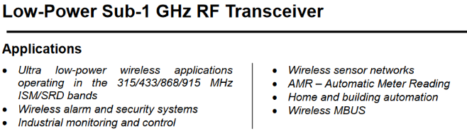

# The Universal Smart Home Ping of Death

In [part 2](./../P2/README.md) we performed an electromagnetic fault injection on a Smart Home device to extract its firmware. This time we will reverse engineer parts of the proprietary radio-protocol used by the same device, build a simple fuzzer and… No spoiler please!

The results have been shared with Bosch PSIRT (2021-11-25).

The code for the simple fuzzer is [here](./code/).

## The device

The Rolladensteuerung (shutter control) is again our guest for today:


This nice device makes your shutters smart and is connected over a wireless interface to the Smart Home Controller. This time we will focus on the wireless interface - that's the easiest entry point for an attacker (definitely easier than EM-FI…). To perform the analysis we need a tool to "sniff" the communication and generate arbitrary packets. The device works in the 868 MHz ISM band, that's what the technical specification says:

> Funkfrequenz 868,3 MHz; 869,5 MHz

There are tons of different wireless protocols used in this band and it happens that Bosch is using a "proprietary protocol", so reverse engineering work is needed here.

Let's open the device and look for the RF module:


Here we see the transceiver module connected to the black quarter-lamda wire antenna. Note that for safety reasons, I bypassed the 230 V to 12 V power supply and supplied the device with 12 V directly (safety first !). In order to reverse engineer the physical layer we need information about the transceiver module. The heart of this module is a Texas Instrument (TI) Integrated Circuit (IC), the CC1101:



This IC needs to be configured with all radio and link parameters before usage after each power-up (no persistent memory). It is connected to the EFM32 microcontroller via a SPI interface. The next step is to sniff the SPI interface and record the parameters. To do that I used my picoscope with the serial decoding feature(one channel clk, one channel data and one channel chip select):


We see in this picture that the microcontroller is writing some data into the CC1101 at boot ttime: 0x0E is written in register 0x00, 0x0E in register 0x01…

## The "fuzzer"

Let's build a very simple fuzzer for this communication protocol. We now have all parameters used for the radio link, we need to control the SPI interface of the transceiver module as a next step. I decided to desolder a transceiver module from a device (actually I took the module from a *Fensterkontakt* which is cheaper and has the same module) and connected it to a [BusPirate](http://dangerousprototypes.com/docs/Bus_Pirate) over SPI. The Bus Pirate itself is connected to a PC over USB. Here is the result:


If you want to build it, here is the pinout of the RF Module (top view):


Connect the SPI signals (CS, CLK, MOSI, MISO) to the Bus Pirate SPI interface and VCC to 3,3 V.

I wrote a [small old-school C program](./code/) to access and configure the Bus Pirate in raw SPI mode (faster than normal mode) and to configure the CC1101 with the parameters extracted above. Simple state machines are used to receive or send arbitrary packets and perform manipulations. Here you can see some received packets using the device as a sniffer:


The CC1101 does not only handle the physical layer but also (part of) the link layer, following packet format is used:


In our case, length field and CRC are used whereas address field is not used. From a security point of view this is important: for example, the CC1101 will automatically discard packets which are too long (maximum length can be configured) or with wrong CRC -a kind of first firewall. Note that the data are also scrambled before being sent but this is done by the EFM32 microcontroller.

The upper communication layers are handled by the embedded microcontroller, an EFM32G210F128 from Silicon Labs. This microcontroller is optimized for low power, has 128 kB Flash and 16 kB SRAM, and it uses execution-in-place (code can be executed from Flash directly). The device has an AES hardware accelerator (!) and a debugger protection ([vulnerable to EM-FI](./../P2/README.md)).

Here are some information about the upper communication layers I was able to found out playing with the device:
* Data scrambling is used (probably for better radio performance and maybe obfuscation - no crypto). It is implemented inside the EFM32 microcontroller. Packet scrambling and descrambling is also implemented in the fuzzer. Note that reverse engineering the scrambling algorithm (and more) involved firmware analysis (extracted in the last article) with Ghidra and on-chip debugging.
* Most of the packets are protected against manipulation, eavesdropping and replay attacks. The device uses AES128-CCM described in the [RFC3610](https://www.rfc-editor.org/rfc/rfc3610). The device uses an individual initial key.
* There are unencrypted small acknowledge (ACK) packets (similar to ZigBee).

Back to our fuzzer: just generating random packets won't work. A good starting point is to use some packets or packet sequences already recorded and manipulate them so that corner cases are generated. Fuzzing is successful if we detect malfunction / crash of the device. Let's record three different valid "sesame-open-the-shutters" commands from the SmartHome controller (hexadecimal values, CRC is omitted, packets are de-scrambled):

> *19* 10 00 8E   **4C 57 F4**   53 D4 01   **00 CF 67 74**   CE 9F BB 19   **54 75 85 10 48 DB C8 FD**

> *19* 10 00 8E   **4C 57 F4**   53 D4 01   **00 CF 67 77**   1D 9C 10 2B   **94 72 5C BD 87 BB 91 1A**

> *19* 10 00 8E   **4C 57 F4**   53 D4 01   **00 CF 67 7C**   F7 5C 0E 79   **03 E3 4B 64 32 AF 89 B9**

Here is the description of the different fields:

| Byte Nr     | Description |
| ----------- | ----------- |
| 0           | length byte (excluding itself). Here we have a 25+1 bytes packet|
| 1..3        | packet parameters (?)|
| 4..6        | source address|
| 7..9        | destination address|
| 10..13      | replay counter|
| 14..17      | encrypted MAC|
| 18..25      | encrypted payload|

If we try to replay one of these packets with our smart-home-fuzzer, we get an ACK packet (*06 4C 57 F4 53 D4 01*) but nothing happens - replay protection works. The device only reacts (i.e. acknowledges) if the destination address is correct. However, the addresses can be easily eavesdropped over the RF channel.

## The ping of death

It happened that for some **shortened packets** a device crash occurs when the following packet is sent to the device: a shortened packet with a valid destination address, a length between 11 and 17 bytes, valid counter and random encrypted payload. The device does not react at the next valid command from the Smart Home Controller - until the next Power On Reset.


This is an example of such a ping of death packet (note that the source address field has been replaced with zeros, it seems not to be checked anyway):

> 0A 10 00 8E 00 00 00 32 6C BB FF

In order to generate these packets, only public information is needed (only the 24 bit destination address field, broadcasted every few minutes) - no secret key. It induces a device crash - in security words a Denial of Service (DoS) attack.

## What could go wrong?

I guess that the RX packet parser does not check for a minimal packet length when receiving non-ACK packets. It calculates the encrypted payload length (without CMAC) and – in case of the shortened packets described above – a negative number comes as a result. This negative number is then interpreted as “unsigned integer” by the device: for example -2 is interpreted as 254 assuming a one-byte encoding. This length is longer that the allocated memory length (the maximum packet size is about 61 bytes). As a consequence, SRAM memory corruption happens, which may (and does in most cases) lead to a crash.
For the sake of explanation, here is a simple C code sequence:

```
#define RX_BUFFER_MAX_LENGTH 61
#define HEADER_LENGTH 17

unsigned byte rx_buffer[RX_BUFFER_MAX_LENGTH]
unsigned byte decrypted_message[RX_BUFFER_MAX_LENGTH-HEADER_LENGTH]

void message_decrpytion() {

   unsigned byte encrypted_message_length = rx_buffer[0] - HEADER_LENGTH;
   unsigned byte i;

   for(i=HEADER_LENGTH;i<encrypted_message_length;i++) {
      decrypted_message[i-HEADER_LENGTH] = byte_decryption(rx_buffer[i]);
   }
}
```

A good hacker would say "Nice, that's the first step, let's go for Remote Code Execution". But since the payload is encrypted with an (attacker) unknown key, it is most probably impossible (never say that). However, we can try to extend the attack a bit.

## The Universal Ping of Death

By analyzing the traffic between Rollandensteuer ungand controller, I found some packets with an interesting destination address field:

> *13* 12 00 83 32 6C BB **F0 00 01** 00 00 01 0C 09 70 23 92 DA B7

In many protocols some broadcast / multicast addresses are defined, and this is probably the case here. If we replace the destination address with this address in the ping of death packet described above, we may get a universal message valid for probably all 868 MHz Bosch smart home devices (cross-networks) listening to the channel continuously (this is not the case for the Fensterkontakt for example):

**0A 10 00 8E 00 00 00 F0 00 01 FF**

Note that depending of the value of the last byte (first counter byte, involved as input in AES computations and therefore defining the corrupted content) the effect may be different. I tried it successfully on 2 different devices (Rolladensteuerung and Zwischenstecker). To build this universal message, no prior information about the device is needed (key, address…). Each device listening to this message will most probably crash. 

## Exploitation

Using higher Transmission (TX) power (the original device uses about 10 mW / 10 dBm transmission power, transmitters / Power Amplifiers (PA) with up to a few W are available and cheap in this band) and/or a better antenna (again: cheap equipment in this ISM band), the range of the transmitter can be heavily extended to several kilometers or tens of kilometers so that a wide area can be affected.

## Conclusion

In this post we saw how to reverse engineer parts of a proprietary communication link of a smart home device and build a simple "fuzzer" device in order to find implementation bugs, which can be used to perform a spectacular DoS attack. We exploited two vulnerabilities: a buffer overflow and a protocol vulnerability (processing packets with broadcast destination address and regardless of source address) to build a universal ping of death message valid for many devices accessible over a radio channel without prior knowledge.
