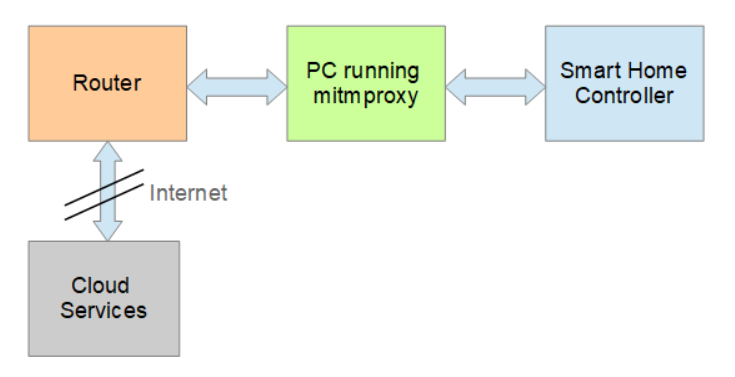

# Set up mitmproxy to sniff TLS traffic of the Bosch Smart Home Controller

In this post you will learn how to set up [mitmproxy](https://mitmproxy.org/) to intercept TLS traffic between the Bosch Smart Home Controller and the Internet to sniff the device's cloud communications.

## Preconditions

First of all, you have to root your device to install mitmproxy's CA certificate. See [here](https://github.com/vegantransistor/BoschSmartHome/blob/main/P1/README.md) on how to do that.

## Setup

Here is a simple block diagram of the setup used:



## Set up dnsmasq

On your Linux machine prepare the Ethernet connection that is connected to the Bosch Smart Home Controller. In this example we are using the following configuration:

```
Interface: enp1s0
IP Address: 192.168.2.1
Netmask: 255.255.255.0
Gateway: 192.168.2.1
```

Next, install the `dnsmasq` package and configure it:

```
interface=enp1s0
dhcp-range=192.168.2.50,192.168.2.150,255.255.255.0,12h
```

## Set up SSH

Now, connect the Smart Home Controller to the Ethernet and serial interface of your PC. Use the serial interface to start the SSH daemon on the device:

```
$ systemctl start ssh
```

Change the firewall rules in `/data/etc/firewall/firewall_config` to:
```
export FIREWALL_INCOMING_LEVEL=0
export FIREWALL_OUTGOING_LEVEL=0
```

In the next step, find out the IP address of the device via `ip addr`:

```
2: eth0: <BROADCAST,MULTICAST,UP,LOWER_UP> mtu 1500 qdisc fq_codel qlen 1000
    link/ether 64:da:a0:03:42:39 brd ff:ff:ff:ff:ff:ff
    inet 169.254.152.138/16 brd 169.254.255.255 scope link eth0
       valid_lft forever preferred_lft forever
    inet 192.168.2.58/24 brd 192.168.2.255 scope global dynamic eth0
       valid_lft 43198sec preferred_lft 43198sec
    inet6 fe80::66da:a0ff:fe03:4239/64 scope link 
       valid_lft forever preferred_lft forever 
```

Then, just ssh into the device (see [here](https://github.com/vegantransistor/BoschSmartHome/blob/main/P1/README.md#getting-a-linux-root-shell) for the password):

```
ssh root@192.168.2.58
```

## Install mitmproxy

Install [mitmproxy](https://mitmproxy.org/) and double-check its Root CA certificates in the `~/.mitmproxy` directory. We will use the `pem`, `der`, `crt` and `jks` formats and configure the proxy in [transparent mode](https://docs.mitmproxy.org/stable/howto-transparent/).

## Replace the Root Certificates

In order to intercept TLS traffic we need to replace the root certificates of the device with the ones from mitmproxy. You'll find most of the certificates in the `/data/etc/certificates/truststore/` folder which is not protected by dm-verity. Replace all certificates with mitmproxy's Root CA certificates.

For the Java keystore file (`.jks`), you can add the MITM Root CA certificate to the device's truststore with the `keytool` command (the password is `key4SH`):

```
keytool -importcert -keystore bosch-smarthome.jks -file mitmproxy-ca-cert.cer -alias mitm
```

## Extract the Device Certificate

Each Bosch Smarthome Controller has its own device certificate and associated private key which we both need for mitmproxy. Go to the `/etc/data/ecm/keys/` folder and `scp` the `device_chain.pem` and `device_key_pair.pem` files to your PC. Copy both file contents into a new file called `device_key_chain.pem`.

## Intercept TLS traffic with mitmproxy

First restart `dnsmasq` and set up IP forwarding plus iptables with the following commands:

```
sudo systemctl restart dnsmasq
sudo sysctl -w net.ipv4.ip_forward=1
sudo sysctl -w net.ipv6.conf.all.forwarding=1
sudo sysctl -w net.ipv4.conf.all.send_redirects=0
sudo iptables -t nat -A PREROUTING -i enp1s0 -p tcp --dport 80 -j REDIRECT --to-port 8080
sudo iptables -t nat -A PREROUTING -i enp1s0 -p tcp --dport 443 -j REDIRECT --to-port 8080
sudo iptables -t nat -A PREROUTING -i enp1s0 -p tcp --dport 8883 -j REDIRECT --to-port 8080
sudo ip6tables -t nat -A PREROUTING -i enp1s0 -p tcp --dport 80 -j REDIRECT --to-port 8080
sudo ip6tables -t nat -A PREROUTING -i enp1s0 -p tcp --dport 443 -j REDIRECT --to-port 8080
sudo ip6tables -t nat -A PREROUTING -i enp1s0 -p tcp --dport 8883 -j REDIRECT --to-port 8080
```

Finally, start mitmproxy:

```
$ mitmproxy --rawtcp --set websocket=false --mode transparent --ssl-insecure --set confdir=[your-path-to-MITM-Root-CA] --set tls_version_client_max=TLS1_2 --set tls_version_server_max=TLS1_2 --set client_certs=[your-custom-path-to]/device_key_chain.pem
```

Now, you should see the (decrypted) traffic in mitmproxy and most of the HTTP requests should be answered with `200`.

Note, that if you export the environmental variable `sslkeyfile` and import it into Wireshark (go to `Preferences > Protocols > TLS > (Pre)-Master secret logfile name`) you'll see the traffic, too.
